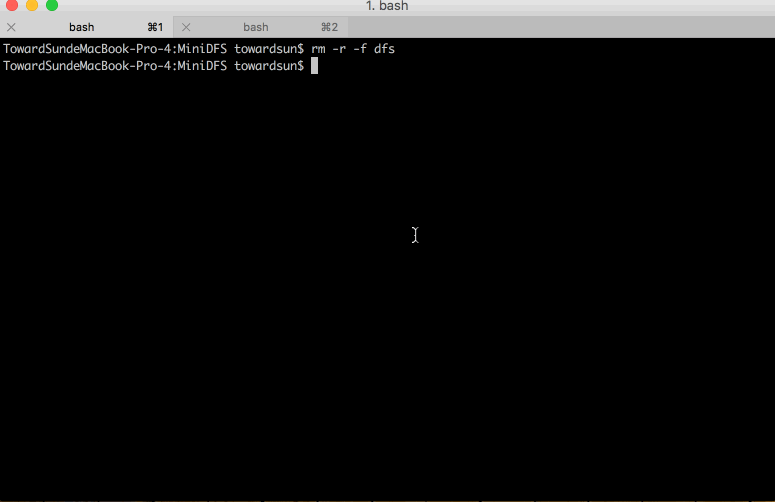

# Mini DFS实现

> Mini DFS实现，通过线程机制，模仿NameNode和DataNode，实现基本的ls、put、read、fetch命令。

## 运行说明
1. 基于python实现，运行mini_dfs.py文件即可:
	`python mini_dfs.py`
	
2. 指令说明：

	```
	# 列出dfs上的全部文件，返回id, name, length
	MiniDFS > ls
	
	# 将本地文件上传到miniDFS，返回ID
	MiniDFS > put source_file_path
	
	# 读取miniDFS上的文件：文件ID，偏移量，长度
	MiniDFS > read file_id offset count
	
	# 下载miniDFS上的文件：文件ID，保存路径
	MiniDFS > fetch file_id save_path
	
	# 退出
	MiniDFS > quit
	```

## 功能说明
> 基于python threading实现，模拟分布式环境下TCP通信环境。

1. 使用1个线程作为NameNode，维护整个DFS的元数据信息和任务调度；使用4个线程作为DataNode，负责文件的存储（每个Block默认为2MB）。

2. 元数据维护基于pickle进行序列化和反序列化。

3. 实现的功能的包括：
	* 文件列表
	* 文件上传
	* 多副本存储
	* 文件读取（下载）

### 存储目录
1. 当前，在当前可执行文件目录，生成的`dfs`文件夹作为DFS文件目录。其中`datanode0/1/2/3`是
每个dataserver的存储目录；namenode是nameserver的存储目录。

2. 文件被拆分后的命令方法和HDFS类似，比如`a.txt-part-0`。

## 功能演示

